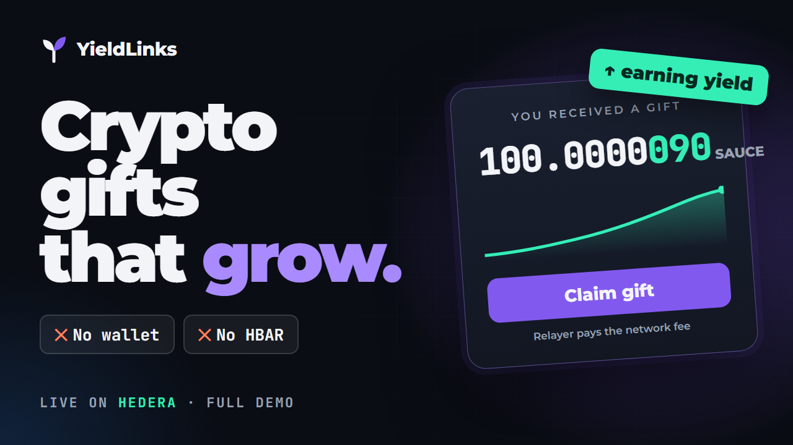
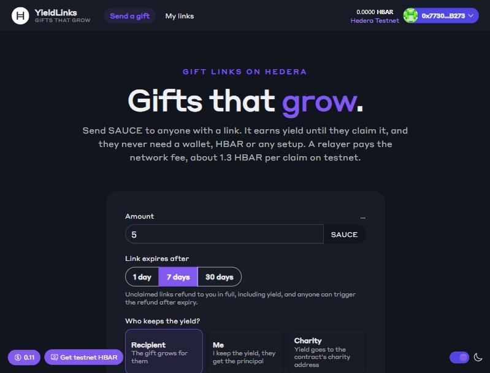
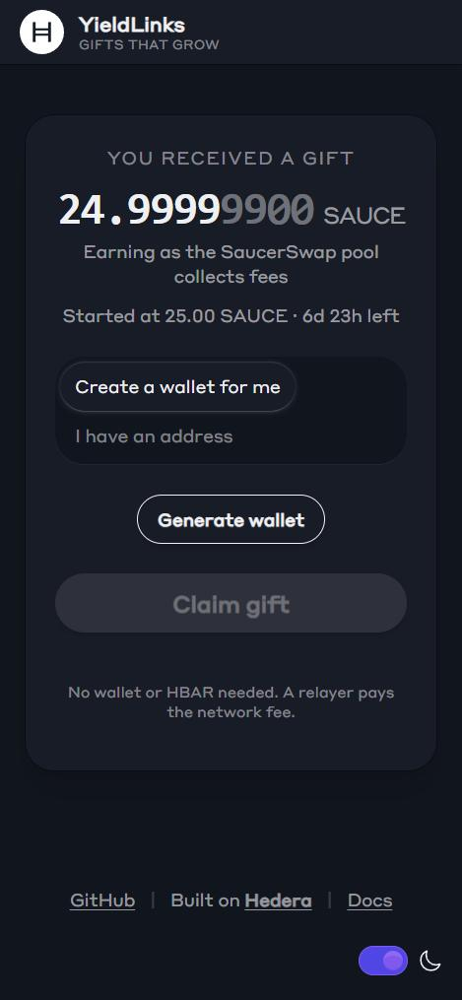
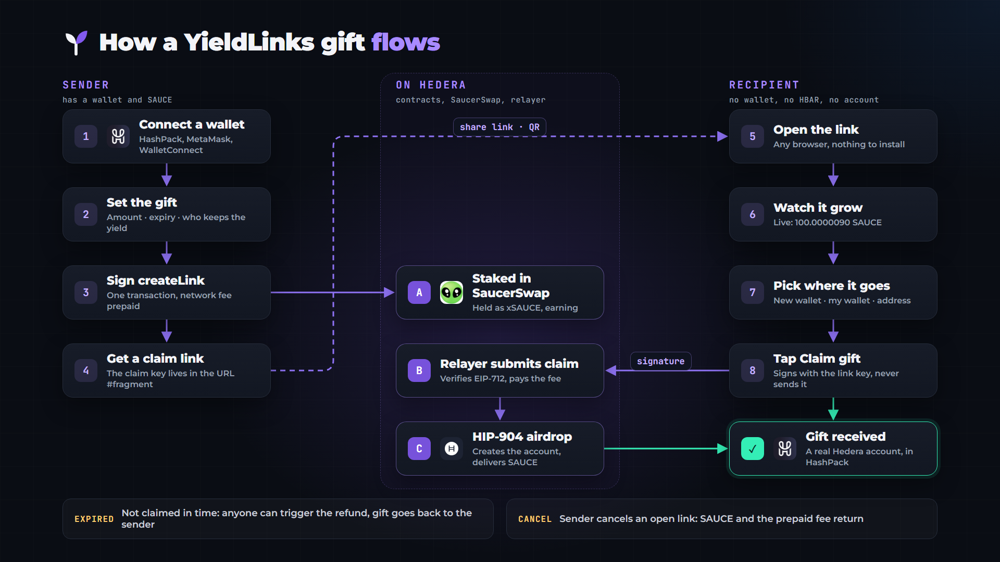
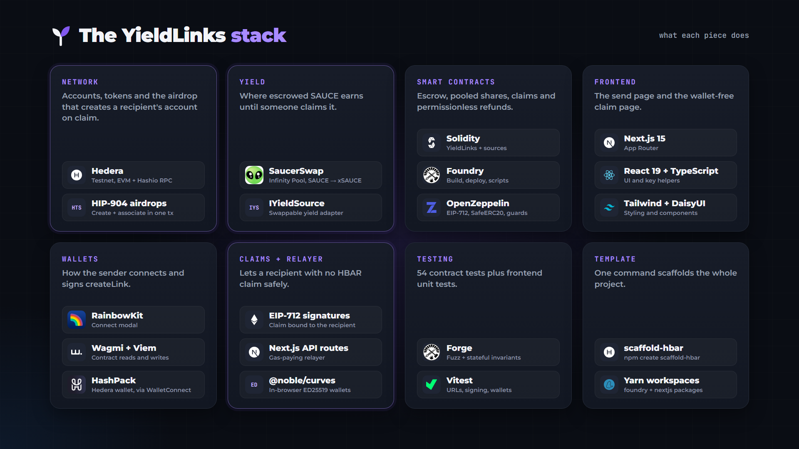
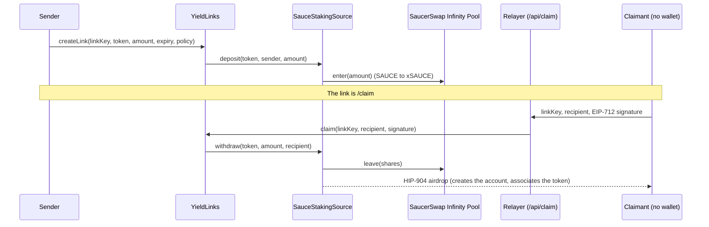

<p align="center">
  <picture>
    <source media="(prefers-color-scheme: dark)" srcset="docs/images/logo-light-ink.svg" />
    
  </picture>
</p>

<h1 align="center">YieldLinks</h1>

<p align="center">
  <strong>Gift links that grow.</strong><br />
  Send tokens to anyone with a link. They earn yield in SaucerSwap until claimed.<br />
  The recipient needs no wallet, no HBAR and no Hedera account.
</p>

<p align="center">
  <a href="https://yield-links-hedera.vercel.app"></a>
  <a href="LICENCE"></a>
  <a href="https://hashscan.io/testnet/contract/0x8221b51a0dAa92fF0B64f6106483A53fD5FA7aaE"></a>
  
  
  
</p>

```bash
npm create scaffold-hbar@latest -- --template shane2512/YieldLinks
```

**Try it live:** [yield-links-hedera.vercel.app](https://yield-links-hedera.vercel.app) (Hedera testnet). Open a claim link on your phone to see the no-wallet flow.

A [scaffold-hbar](https://docs.hedera.com/solutions/tools/scaffold-hbar) template for one pattern: **park tokens somewhere productive, then release them to a person who has not onboarded yet.** The sender stakes SAUCE in SaucerSwap's Infinity Pool and gets a link. The recipient opens it, taps once, and Hedera creates their account and delivers the token. A relayer pays the network fee, which the sender prepaid with the link.

Fork it for gifts, payroll to new hires, bounties that refund themselves, referral rewards, or an allowance a child claims into a brand-new account.

<p align="center">
  <a href="https://youtu.be/NsjGGW38Ufs"></a><br />
  <sub><a href="https://youtu.be/NsjGGW38Ufs">▶ Watch the 3-minute demo</a>: the problem, the scaffold, creating a link, and claiming with no wallet on Hedera testnet.</sub>
</p>

## Contents

- [Demo video](https://youtu.be/NsjGGW38Ufs)
- [The problem](#the-problem)
- [What it looks like](#what-it-looks-like)
- [User flow](#user-flow)
- [Bounty checklist](#bounty-checklist)
- [Ecosystem integration: SaucerSwap](#ecosystem-integration-saucerswap)
- [Hedera services used](#hedera-services-used)
- [Tech stack](#tech-stack)
- [Proof it works](#proof-it-works)
- [Quickstart](#quickstart-about-5-minutes)
- [How it works](#how-it-works)
- [Project layout](#project-layout)
- [Configuration](#configuration)
- [Deploy your own](#deploy-your-own) · [Extend it](#extend-it) · [Testing](#testing)
- [Building with an AI agent](#building-with-an-ai-agent)
- [Security](#security) · [Limitations](#limitations-and-honest-notes) · [Troubleshooting](#troubleshooting)

## The problem

Sending tokens to someone new on Hedera takes a dozen steps on their side: install a wallet, back up a key, buy HBAR on an exchange, withdraw it, associate the token, then send an address back. Until they finish, the tokens sit idle in the sender's wallet.

YieldLinks removes every step on the recipient's side and puts the waiting time to work:

| Without YieldLinks | With YieldLinks |
| --- | --- |
| Recipient needs a wallet before anything happens | Recipient opens a link in any browser |
| Recipient needs HBAR for fees | A relayer pays, from a fee the sender prepaid |
| Token must be associated first | HIP-904 airdrop creates and associates in one step |
| Tokens earn nothing while you wait | Tokens are staked in SaucerSwap and grow until claimed |
| Unclaimed tokens are stuck | Anyone can refund an expired link to the sender |

## What it looks like

| Sender (desktop) | Recipient (phone, no wallet) |
| --- | --- |
|  |  |

The recipient's page deliberately shows no wallet, faucet or network chrome: only the gift and the claim controls.

## User flow



## Bounty checklist

Every item in the Scaffold-HBAR Template Bounty eligibility gate, and where to check it.

| Gate requirement | Status | Evidence |
| --- | --- | --- |
| Scaffolds via `npm create scaffold-hbar@latest -- --template owner/repo` | ✅ | `npm create scaffold-hbar@latest -- --template shane2512/YieldLinks` |
| `template.json` manifest present and valid | ✅ | [`template.json`](template.json): capabilities, defaults, Node requirement, post-install steps |
| `README.md` and `AGENTS.md` present | ✅ | This file and [`AGENTS.md`](AGENTS.md) |
| Monorepo with separate packages for contracts and frontend | ✅ | [`packages/foundry`](packages/foundry) and [`packages/nextjs`](packages/nextjs), Yarn workspaces |
| Install, lint and build pass from a fresh scaffold | ✅ | `yarn install`, `yarn next:lint`, `yarn foundry:lint`, `yarn next:build` (see [Testing](#testing)) |
| App boots and core routes return OK | ✅ | `/` (send), `/claim` (claim), `/links` (your links), `/api/claim` (relayer), all live at [yield-links-hedera.vercel.app](https://yield-links-hedera.vercel.app) |
| At least one Hedera service in play | ✅ | Solidity on Hedera, HTS association, HIP-904 airdrop, account creation, mirror node (see [Hedera services used](#hedera-services-used)) |
| Verifiable testnet transaction with a HashScan link | ✅ | [Proof it works](#proof-it-works): deploy, create, claim to a new account, cancel |
| No committed secrets and no committed `.env` | ✅ | `.env*` is git-ignored; only `.env.example` files are committed |
| MIT licence, original work | ✅ | [`LICENCE`](LICENCE) |
| Harness spec and validators, if the harness was used | n/a | Hedera Harness was not used |

## Ecosystem integration: SaucerSwap

**SaucerSwap's Infinity Pool is load-bearing.** It is both where the escrowed tokens are held and the reason the gift grows. Remove it and the template has no yield and nowhere to keep the funds.

- `createLink` stakes the sender's SAUCE into the Infinity Pool (`enter`, SAUCE to xSAUCE) through [`SauceStakingSource`](packages/foundry/contracts/sources/SauceStakingSource.sol).
- A link's value is read live from the pool's xSAUCE exchange rate, so every open link earns without per-link bookkeeping.
- `claim` and refunds unstake (`leave`) and pay out the grown amount.
- The venue sits behind a three-function [`IYieldSource`](packages/foundry/contracts/interfaces/IYieldSource.sol) interface, so a developer can swap in another protocol without touching the escrow contract.

What a developer gets that is hard to build alone: escrow against a key, yield while waiting, pooled share accounting with inflation-attack protection, and release to a signature, already wired to a live Hedera DEX.

## Hedera services used

| Service | Where | What it does here |
| --- | --- | --- |
| **Smart contracts (Solidity on Hedera EVM)** | [`YieldLinks.sol`](packages/foundry/contracts/YieldLinks.sol) | Escrow, pooled shares, EIP-712 claims and permissionless refunds, with no owner and no upgrade path |
| **HTS token association** | [`HtsLib.sol`](packages/foundry/contracts/libraries/HtsLib.sol) | Contracts associate themselves with SAUCE and xSAUCE through the `0x167` precompile |
| **HTS HIP-904 airdrop** | [`ControlledSource.sol`](packages/foundry/contracts/sources/ControlledSource.sol) | A payout to an address Hedera has never seen creates the account and associates the token in one transaction |
| **Account creation (Hiero SDK)** | [`/api/create-account`](packages/nextjs/app/api/create-account/route.ts) | Creates a real ED25519 account for a wallet generated in the browser, so it imports into HashPack |
| **Mirror node** | [`utils/relayer`](packages/nextjs/utils/relayer) | Authoritative nonces after failed transactions, and account lookups before creating a wallet |

## What it demonstrates

| Capability | How it is used here |
| --- | --- |
| **SaucerSwap Infinity Pool** (load-bearing) | Escrowed SAUCE is staked as xSAUCE. Take it away and there is no yield and nowhere to hold the funds. Behind a swappable `IYieldSource` interface. |
| **HTS HIP-904 airdrop** | Payouts create the recipient's account and associate the token in the same transaction. A never-seen-before address just receives. |
| **HTS association** | Contracts associate themselves with the tokens they hold. |
| **EIP-712 claims** | The link key signs a claim bound to the recipient, chain and contract, so a mempool watcher cannot redirect funds. |
| **Pooled share accounting** | Yield accrues to every link without per-link bookkeeping; virtual shares stop the first-depositor inflation attack. |
| **Gas-paying relayer** | A Next.js route submits claims, so claimants need no HBAR. It simulates first and can only call `claim`. |

## Tech stack



## Proof it works

Everything below is a real Hedera testnet transaction from `yarn foundry:deploy` and `yarn foundry:demo` (run on 3 Oct 2026).

| Step | Transaction |
| --- | --- |
| Deploy `SauceStakingSource` | [`0x8343e36b…`](https://hashscan.io/testnet/transaction/0x8343e36b65aff4d9e078cde7882cffdf8bdef762db79e0b7787c9fc65e2a2cb3) |
| Deploy `YieldLinks` | [`0x7c3ebaea…`](https://hashscan.io/testnet/transaction/0x7c3ebaea3d9ded236767a231fa4182b07460b22d4c0f13ac433be9be6bce6f39) |
| `createLink`: 2 SAUCE staked in SaucerSwap, 1.5 HBAR fee prepaid | [`0x11cf2f7c…`](https://hashscan.io/testnet/transaction/0x11cf2f7c125e97cf798e5f532bfd5854df7958d992caf2a7fc18739c79619005) |
| `claim` to an address Hedera had never seen: recipient received 2.000009 SAUCE | [`0xfda1fe45…`](https://hashscan.io/testnet/transaction/0xfda1fe45597f7ba0b8c444ff9b3b185c796e1805cd8ec13de91437ec815ca7af) |
| Account created by that claim | [`0.0.10830206`](https://hashscan.io/testnet/account/0.0.10830206) |
| Create a second link | [`0x79f45668…`](https://hashscan.io/testnet/transaction/0x79f456680abe3e84f6b3fa3d9866b0a96efdc52431f3c7950f757e3c59d61d5c) |
| Cancel it: SAUCE and the prepaid fee return to the sender | [`0xa69f39d6…`](https://hashscan.io/testnet/transaction/0xa69f39d640214bdac87911671a1199f0e8f492bbedd046f88e3ebf56da9561af) |

Contracts: [`YieldLinks` 0x8221b51a…7aaE](https://hashscan.io/testnet/contract/0x8221b51a0dAa92fF0B64f6106483A53fD5FA7aaE) and [`SauceStakingSource` 0x14eAb4ef…160d](https://hashscan.io/testnet/contract/0x14eAb4ef4611fe8AFc2FB8B1A8626dbB3fAC160d).

**The sender pays every cost; the recipient gets at least the gift.** Sending 5 SAUCE delivers at least 5 SAUCE. The sender adds a 10-unit rounding reserve (0.00001 SAUCE) on top of the gift, so staking rounding can never leave the recipient short, and prepays a 1.5 HBAR network fee with the link. The fee reimburses whoever submits the claim (the relayer, which also funds the new account) and returns to the sender if the link is cancelled. The relayer refuses links that did not prepay, so it never spends HBAR on them. Measured on testnet at about $0.105 per HBAR: claim 0.74 HBAR, account creation 0.58 HBAR including the 0.1 HBAR welcome balance, about 1.32 HBAR in total, inside the prepaid 1.5.

## Quickstart (about 5 minutes)

**Prerequisites**

- Node.js 20.18.3 or later, and Yarn (`npm i -g yarn`)
- [Foundry](https://book.getfoundry.sh/getting-started/installation) (`forge`, `cast`)
- A Hedera testnet account with HBAR from the [Hedera Portal faucet](https://portal.hedera.com/faucet)

**1. Scaffold and install**

```bash
npm create scaffold-hbar@latest -- --template shane2512/YieldLinks
cd <your-project>
yarn install
```

**2. Configure the relayer.** Create `packages/nextjs/.env.local`:

```bash
# Server-only. A dedicated, lightly funded testnet account that pays claim fees.
RELAYER_PRIVATE_KEY=0x...
```

**3. Run the app**

```bash
yarn next:dev        # http://localhost:3000
```

The frontend already points at the testnet deployment listed above, so it works immediately. To deploy your own, see [Deploy your own](#deploy-your-own).

**4. Get test SAUCE.** The app sends SAUCE, so the sending wallet needs some.

The easiest way is to swap testnet HBAR for SAUCE on **[SaucerSwap testnet](https://testnet.saucerswap.finance/)**: connect your wallet (HashPack works), make sure it is on **Testnet**, then swap HBAR → SAUCE. If it asks to associate SAUCE with your account, approve it.

Prefer the terminal? With Foundry's `cast` and a funded testnet key:

```bash
ME=<your 0x address>; KEY=<your private key>; RPC=https://testnet.hashio.io/api
SAUCE=0x0000000000000000000000000000000000120f46
WHBAR=0x0000000000000000000000000000000000003aD2
ROUTER=0x0000000000000000000000000000000000004b40   # SaucerSwap V1 router, 0.0.19264

# associate the token with your account, then swap 20 HBAR for SAUCE
cast send 0x0000000000000000000000000000000000000167 "associateToken(address,address)" $ME $SAUCE \
  --private-key $KEY --rpc-url $RPC --legacy --gas-limit 1000000
cast send $ROUTER "swapExactETHForTokens(uint256,address[],address,uint256)" 1 "[$WHBAR,$SAUCE]" $ME \
  $(( $(date +%s) + 600 )) --value 20ether --private-key $KEY --rpc-url $RPC --legacy --gas-limit 1500000
```

**5. Send a gift.** Connect a wallet, enter an amount, create the link, and open it in another browser. The claim page lets the recipient generate a wallet in the browser or paste an address, then claim.

**Prefer a terminal?** `yarn foundry:demo` runs the whole flow on testnet (create, claim to a brand-new address, cancel) and prints HashScan links. It needs `DEPLOYER_PRIVATE_KEY` in `packages/foundry/.env` and at least 4 SAUCE in that account.

## How it works



**Accounting.** Each token has one pool of shares. Creating a link mints
`shares = amount * (totalShares + 1000) / (totalAssets + 1000)`. A link's value is
`shares * (totalAssets + 1000) / (totalShares + 1000)`, and `totalAssets` is the staked SAUCE value plus idle SAUCE, read from the pool. When the pool earns, every link's value rises without writing to storage. The `+ 1000` virtual offset keeps the first depositor from inflating the share price against later users. The cost is a permanent 0.001 SAUCE "dead" position that captures a proportional sliver of yield, which stays in the source.

**Life of a link.** `Open`, then either `Claimed` (by a valid signature before expiry) or `Refunded` (the sender cancels at any time; anyone can trigger it after expiry). Links are never deleted, so a signature for a spent link can never be replayed against a reused key.

**Who keeps the yield.** Chosen per link: `Recipient` (the gift grows for them), `Sender` (recipient gets the gift amount, the sender keeps the growth) or `Charity` (the contract's `CHARITY` address).

**Generated wallets and wallet apps.** The claim page offers three ways to receive: create a wallet in the browser, connect an existing wallet, or paste an address. A created wallet is a real **ED25519 Hedera account**, the type HashPack makes and imports by default. The browser generates the key; the relayer creates the account for its public key (`/api/create-account`, 0.1 HBAR welcome balance, unlimited token auto-association), proving nothing but that the caller holds an open link; then the claim pays that account. Because the account is created with its key, wallet apps can find it by key straight away. The success screen shows the account ID and the private key as the 96-character DER form (`302e…`) and the 64-character form, plus the import steps. An ED25519 account works in HashPack, Blade and Hedera tools but not in MetaMask, which only takes EVM (ECDSA) keys: MetaMask users should choose **My wallet**. Creating the account costs the relayer about 0.58 HBAR (0.48 fee plus the 0.1 HBAR welcome balance) on top of the claim.

## Project layout

```
packages/
  foundry/
    contracts/
      YieldLinks.sol              escrow, share accounting, EIP-712 claims, refunds
      interfaces/IYieldSource.sol the seam: where escrowed tokens sit and earn
      interfaces/IMothership.sol  SaucerSwap Infinity Pool (SushiBar-shaped)
      sources/ControlledSource.sol  one-time controller binding, HIP-904 payout
      sources/SauceStakingSource.sol  stakes SAUCE in the Infinity Pool
      sources/IdleSource.sol      no yield; reference implementation, used on plain Anvil
      libraries/HtsLib.sol        association and airdrop, no-ops where HTS does not exist
    script/Deploy.s.sol           deploys source, YieldLinks, binds them
    test/                         54 tests (unit, fuzz, stateful invariants, attack cases, HTS delivery)
    scripts-js/demo.js            `yarn foundry:demo`
  nextjs/
    app/page.tsx                  send a gift
    app/claim/page.tsx            claim a gift (no wallet needed)
    app/links/page.tsx            your links, cancel and refund
    app/api/claim/route.ts        gas-paying relayer
    app/api/create-account/route.ts  creates the ED25519 account for a generated wallet
    components/yieldlinks/        create form, claim card and success screen, growing balance, link list
    utils/relayer/                server-only helpers shared by the relayer routes
    utils/yieldlinks/             link keys, claim URLs, EIP-712 signing, ED25519 wallets (unit tested)
docs/
  THREAT_MODEL.md                 what can go wrong and what stops it
  HEDERA_NOTES.md                 platform gotchas found while building this
```

## Configuration

| Variable | Where | Purpose |
| --- | --- | --- |
| `RELAYER_PRIVATE_KEY` | `packages/nextjs/.env.local` | Server-only key that pays claim fees. Never prefix with `NEXT_PUBLIC_`. |
| `NEXT_PUBLIC_WALLET_CONNECT_PROJECT_ID` | `packages/nextjs/.env.local` | Optional, for WalletConnect. |
| `NEXT_PUBLIC_HEDERA_TESTNET_RPC_URL` / `..._MAINNET_RPC_URL` | `packages/nextjs/.env.local` | Optional RPC overrides (default Hashio). |
| `DEPLOYER_PRIVATE_KEY` | `packages/foundry/.env` | Only for `yarn foundry:demo`. |
| `CHARITY_ADDRESS` | deploy-time env | Receives yield for `Charity` links. Defaults to the deployer. |
| `SOURCE_HBAR_RESERVE` | deploy-time env | Wei-style HBAR sent to the source as a fee reserve. Optional; the deployer can withdraw it with `withdrawHbar`. |

## Deploy your own

```bash
yarn foundry:account:generate    # or foundry:account:import: a keystore whose address exists on Hedera
yarn foundry:deploy --network hedera_testnet
```

This deploys the source and `YieldLinks`, binds them, and regenerates `packages/nextjs/contracts/deployedContracts.ts`. On Hedera chains (testnet, mainnet and a local fork with chain id 296) the source stakes SAUCE in SaucerSwap. On any other chain, for example plain Anvil (`yarn foundry:chain`), it deploys `IdleSource` so the app still runs without yield.

## Extend it

**Add a yield venue.** Implement three functions and deploy with your source instead of `SauceStakingSource`. `YieldLinks` never changes.

```solidity
interface IYieldSource {
    function totalAssets(address token) external view returns (uint256); // value held, including yield
    function deposit(address token, address from, uint256 amount) external; // pull from `from`, put to work
    function withdraw(address token, uint256 amount, address to) external; // unwind and pay `to`
}
```

Inherit `ControlledSource` to get the one-time controller binding and the HIP-904 `_send` payout. `IdleSource` is the smallest working example; `SauceStakingSource` shows a real venue with rounding handled.

**Support another token.** `SauceStakingSource` rejects tokens other than SAUCE. A source for a different yield-bearing token follows the same shape; the frontend reads the token from `SAUCE()` on the source, so change that read when you change the token.

**Fork it into something else.** The pattern is "escrow against a key, earn while waiting, release to a signature". Payroll to new hires (claim = start date), referral rewards (yield pays for the campaign), bounties that auto-refund, or an allowance a child claims into a new account.

## Building with an AI agent

[`AGENTS.md`](AGENTS.md) is the briefing for Claude Code, Cursor and Codex (`CLAUDE.md` points to it). It covers the commands, the layout, the eight invariants an agent must not break, secret handling, the steps for adding a yield source, and the Hedera pitfalls that cost the most time. The repository also ships a Solidity security skill and a code-review agent under [`.agents/`](.agents).

## Security

See [docs/THREAT_MODEL.md](docs/THREAT_MODEL.md). In short: a link is bearer value, so treat it like cash; claims are bound to a recipient so a watcher cannot redirect them; the relayer can only call `claim`; and nothing in the contracts needs a keeper or a schedule. **This has not been audited.**

## Limitations and honest notes

- **Testnet yield is small.** On 2 Oct 2026 one xSAUCE was worth 1.003 SAUCE on testnet, so a link's balance barely moves in a demo. The claim page shows the real, tiny number and ticks only between on-chain reads (an estimate, labeled as such).
- **SAUCE only.** One token per source. It is volatile, so a gift's dollar value moves with the market.
- **Bonzo Finance was tried first and is not used.** Its testnet pool rejects every supply because the rewards controller does not authorize the aTokens (`CALLER_NOT_AUTHORIZED`, traced on the mirror node), and its mainnet pool reports `paused() = true` with a near-zero USDC rate. Details in [docs/HEDERA_NOTES.md](docs/HEDERA_NOTES.md).
- **No Hedera Schedule Service.** Refunds are permissionless instead of scheduled. HIP-1215 `scheduleCall` has an open bug when booked from a delegatecall frame ([#27263](https://github.com/hiero-ledger/hiero-consensus-node/issues/27263)), a 62-day expiry cap, and self-rescheduling is unproven, so nothing here depends on it.
- **Who pays the account-creation fee depends on the network version.** On 1 Oct the HIP-904 airdrop appeared as a `TOKENAIRDROP` child record and the sending contract paid 0.48 HBAR; on 2 Oct the account was created inside the claim and the relayer paid the single 1.28 HBAR fee, with the contract untouched. The source accepts an HBAR reserve as a safety margin and the deployer can take it back. Evidence in [docs/HEDERA_NOTES.md](docs/HEDERA_NOTES.md).
- **The relayer is a single key.** It is rate limited per IP in memory and serialized. For production use a queue, per-user limits and a dedicated funding policy.
- **In-browser wallets are demo-grade onboarding.** The claim page generates a key and asks the user to save it. A production app should use passkeys or an embedded wallet. Importing into HashPack has been checked by looking the account up by its key on the mirror node and parsing the key the way a wallet does; it has not been tested inside HashPack from this repository.

## Troubleshooting

| Symptom | Cause and fix |
| --- | --- |
| `WRONG_NONCE` when sending | Hashio's nonce lags after failed transactions. Read `ethereum_nonce` from the mirror node and pass it explicitly (the relayer and demo already do). |
| `Gas price ... is below configured minimum` | Send legacy transactions with the node's gas price; ethers' EIP-1559 estimate can fall below Hedera's minimum. |
| Claim returns `LinkNotOpen` or `LinkExpired` | The link was already claimed or cancelled, or it passed its expiry. |
| Claim returns `Relayer is not configured` | Set `RELAYER_PRIVATE_KEY` in `packages/nextjs/.env.local` and restart. |
| A wallet app says "no accounts found" for a generated key | Check the wallet is on the right network (this app's testnet accounts only exist on **Testnet**, so pick it on HashPack's import screen) and that you pasted the key shown on the success screen of *that* wallet. Keys from a wallet created before the ED25519 change are ECDSA keys and are not the same thing. |
| Form shows no balance | The wallet holds no SAUCE. Swap testnet HBAR for SAUCE on [SaucerSwap testnet](https://testnet.saucerswap.finance/), or use the `cast` commands in step 4. |
| Reads look stale after a transaction | Hashio can serve state a few seconds behind. Wait and refresh. |
| `forge script` runs out of gas in simulation | `yarn foundry:deploy` already passes `--gas-limit 14000000` on Hedera networks. If you run `forge script` yourself, add it: a two-contract script is simulated in one call. |

## Testing

```bash
yarn foundry:test      # 54 tests: accounting, attacks, expiry/refund, fuzz, stateful invariants, HTS delivery, staking source
yarn foundry:lint      # forge fmt --check and prettier on scripts
yarn next:lint
yarn next:check-types
yarn next:test         # 41 tests: claim URLs, EIP-712 signatures, ED25519 wallets checked against the Hedera SDK, wallet errors
yarn next:build
yarn foundry:demo      # live testnet proof
```

## Licence

MIT. See [LICENCE](LICENCE). Built by [shane2512](https://github.com/shane2512) on [scaffold-hbar](https://docs.hedera.com/solutions/tools/scaffold-hbar).
