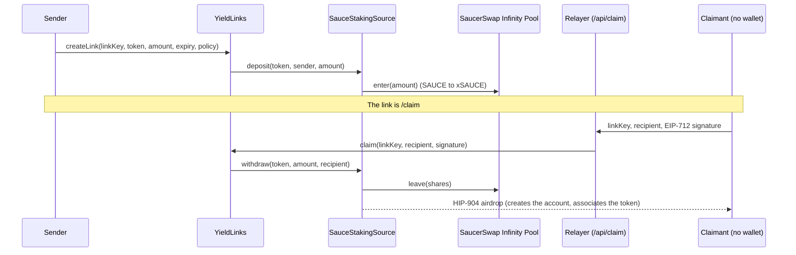

# YieldLinks

**Gift links that grow.** A [scaffold-hbar](https://docs.hedera.com/solutions/tools/scaffold-hbar) template for sending tokens to someone who has no wallet, no HBAR and no account yet, while the tokens earn yield until they are claimed.

The sender stakes SAUCE in SaucerSwap's Infinity Pool and gets a link. The recipient opens it, taps once, and Hedera creates their account and delivers the token. A relayer pays the network fee, so the recipient needs nothing.

Use it as the starting point for any app that has to **park tokens somewhere productive, then release them to a person who has not onboarded yet**: gifts, payroll to new hires, bounties, referral rewards, allowance for kids.

```bash
npm create scaffold-hbar@latest -- --template shane2512/YieldLinks
```

## What it looks like

| Sender (desktop) | Recipient (phone, no wallet) |
| --- | --- |
|  |  |

The recipient's page deliberately shows no wallet, faucet or network chrome: only the gift and the claim controls.

## What it demonstrates

| Capability | How it is used here |
| --- | --- |
| **SaucerSwap Infinity Pool** (load-bearing) | Escrowed SAUCE is staked as xSAUCE. Take it away and there is no yield and nowhere to hold the funds. Behind a swappable `IYieldSource` interface. |
| **HTS HIP-904 airdrop** | Payouts create the recipient's account and associate the token in the same transaction. A never-seen-before address just receives. |
| **HTS association** | Contracts associate themselves with the tokens they hold. |
| **EIP-712 claims** | The link key signs a claim bound to the recipient, chain and contract, so a mempool watcher cannot redirect funds. |
| **Pooled share accounting** | Yield accrues to every link without per-link bookkeeping; virtual shares stop the first-depositor inflation attack. |
| **Gas-paying relayer** | A Next.js route submits claims, so claimants need no HBAR. It simulates first and can only call `claim`. |

## Proof it works

Everything below is a real Hedera testnet transaction from `yarn foundry:demo` (run on 2 Oct 2026).

| Step | Transaction |
| --- | --- |
| Deploy `SauceStakingSource` | [`0x8d77b6b3…`](https://hashscan.io/testnet/transaction/0x8d77b6b37857ab3e87b5f08972dd44ca542b5b0788d48938570de87df137f7b8) |
| Deploy `YieldLinks` | [`0xa63d6417…`](https://hashscan.io/testnet/transaction/0xa63d6417a32a1cf78b914553e97770ac5715212df4cc55cb2d40e6f772983637) |
| `createLink`: 2 SAUCE staked in SaucerSwap | [`0x0bb39cae…`](https://hashscan.io/testnet/transaction/0x0bb39cae0368e3aa115d844817d2afd3ee002ec02124b42baa826ba7815f4adb) |
| `claim` to an address Hedera had never seen | [`0xc753f953…`](https://hashscan.io/testnet/transaction/0xc753f9538b8941082205486896afc8ae3ee18bcc3a7596c3bf425940f384bf7d) |
| Account created by that claim | [`0.0.10821397`](https://hashscan.io/testnet/account/0.0.10821397) |
| Cancel an unclaimed link | [`0x52667b31…`](https://hashscan.io/testnet/transaction/0x52667b312b5102db129708fa2030c544775a664826dba8311ab806132b22ecaf) |

Contracts: [`YieldLinks` 0x8987B3d6…E26A](https://hashscan.io/testnet/contract/0x8987B3d66219B08872c9C790E2b234f95DB9E26A) and [`SauceStakingSource` 0x0D07FBC2…Ac98](https://hashscan.io/testnet/contract/0x0D07FBC25c8FD9105A86B0177fe684409e47Ac98).

Measured fees on testnet at about $0.105 per HBAR: claim 1.28 HBAR, create 0.76 HBAR, cancel 0.71 HBAR. Hedera fees are predictable and USD-denominated, but contract calls that unstake and create accounts are not free.

## Quickstart (about 5 minutes)

**Prerequisites**

- Node.js 20.18.3 or later, and Yarn (`npm i -g yarn`)
- [Foundry](https://book.getfoundry.sh/getting-started/installation) (`forge`, `cast`)
- A Hedera testnet account with HBAR from the [Hedera Portal faucet](https://portal.hedera.com/faucet)

**1. Scaffold and install**

```bash
npm create scaffold-hbar@latest -- --template shane2512/YieldLinks
cd <your-project>
yarn install
```

**2. Configure the relayer.** Create `packages/nextjs/.env.local`:

```bash
# Server-only. A dedicated, lightly funded testnet account that pays claim fees.
RELAYER_PRIVATE_KEY=0x...
```

**3. Run the app**

```bash
yarn next:dev        # http://localhost:3000
```

The frontend already points at the testnet deployment listed above, so it works immediately. To deploy your own, see [Deploy your own](#deploy-your-own).

**4. Get test SAUCE.** The app sends SAUCE, so the sending wallet needs some. With Foundry's `cast` and a funded testnet key:

```bash
ME=<your 0x address>; KEY=<your private key>; RPC=https://testnet.hashio.io/api
SAUCE=0x0000000000000000000000000000000000120f46
WHBAR=0x0000000000000000000000000000000000003aD2
ROUTER=0x0000000000000000000000000000000000004b40   # SaucerSwap V1 router, 0.0.19264

# associate the token with your account, then swap 20 HBAR for SAUCE
cast send 0x0000000000000000000000000000000000000167 "associateToken(address,address)" $ME $SAUCE \
  --private-key $KEY --rpc-url $RPC --legacy --gas-limit 1000000
cast send $ROUTER "swapExactETHForTokens(uint256,address[],address,uint256)" 1 "[$WHBAR,$SAUCE]" $ME \
  $(( $(date +%s) + 600 )) --value 20ether --private-key $KEY --rpc-url $RPC --legacy --gas-limit 1500000
```

**5. Send a gift.** Connect a wallet, enter an amount, create the link, and open it in another browser. The claim page lets the recipient generate a wallet in the browser or paste an address, then claim.

**Prefer a terminal?** `yarn foundry:demo` runs the whole flow on testnet (create, claim to a brand-new address, cancel) and prints HashScan links. It needs `DEPLOYER_PRIVATE_KEY` in `packages/foundry/.env` and at least 4 SAUCE in that account.

## How it works



**Accounting.** Each token has one pool of shares. Creating a link mints
`shares = amount * (totalShares + 1000) / (totalAssets + 1000)`. A link's value is
`shares * (totalAssets + 1000) / (totalShares + 1000)`, and `totalAssets` is the staked SAUCE value plus idle SAUCE, read from the pool. When the pool earns, every link's value rises without writing to storage. The `+ 1000` virtual offset keeps the first depositor from inflating the share price against later users. The cost is a permanent 0.001 SAUCE "dead" position that captures a proportional sliver of yield, which stays in the source.

**Life of a link.** `Open`, then either `Claimed` (by a valid signature before expiry) or `Refunded` (the sender cancels at any time; anyone can trigger it after expiry). Links are never deleted, so a signature for a spent link can never be replayed against a reused key.

**Who keeps the yield.** Chosen per link: `Recipient` (the gift grows for them), `Sender` (recipient gets the principal) or `Charity` (the contract's `CHARITY` address).

**Generated wallets and wallet apps.** The claim page offers three ways to receive: generate a wallet in the browser, connect an existing wallet, or paste an address. A generated wallet is a brand-new Hedera account, and Hedera records an account's public key only when it signs its first transaction. Wallet apps such as HashPack find accounts *by public key*, so importing the key straight after the claim reports "no account found". To avoid that, the claim page **activates** the account: `/api/activate` sends 0.1 HBAR, then the browser signs one tiny transaction with the generated key (about 0.017 HBAR). It only funds addresses that a `YieldLinks` claim paid and whose key is not yet on record, so it cannot be used as a faucet. A claim to a generated wallet therefore costs the relayer about 1.4 HBAR instead of 1.28. After activation the page shows the account ID, the **64-character private key** (what HashPack's import field and MetaMask take) and, for Hedera SDK and CLI tools only, the DER form, plus the import steps.

## Project layout

```
packages/
  foundry/
    contracts/
      YieldLinks.sol              escrow, share accounting, EIP-712 claims, refunds
      interfaces/IYieldSource.sol the seam: where escrowed tokens sit and earn
      interfaces/IMothership.sol  SaucerSwap Infinity Pool (SushiBar-shaped)
      sources/ControlledSource.sol  one-time controller binding, HIP-904 payout
      sources/SauceStakingSource.sol  stakes SAUCE in the Infinity Pool
      sources/IdleSource.sol      no yield; reference implementation, used on plain Anvil
      libraries/HtsLib.sol        association and airdrop, no-ops where HTS does not exist
    script/Deploy.s.sol           deploys source, YieldLinks, binds them
    test/                         38 tests (unit, fuzz, stateful invariants, attack cases, HTS delivery)
    scripts-js/demo.js            `yarn foundry:demo`
  nextjs/
    app/page.tsx                  send a gift
    app/claim/page.tsx            claim a gift (no wallet needed)
    app/links/page.tsx            your links, cancel and refund
    app/api/claim/route.ts        gas-paying relayer
    app/api/activate/route.ts     funds a claimed wallet so wallet apps can find it
    components/yieldlinks/        create form, claim card and success screen, growing balance, link list
    utils/relayer/                server-only helpers shared by the relayer routes
    utils/yieldlinks/             key generation, claim URLs, EIP-712 signing, activation rules (unit tested)
docs/
  THREAT_MODEL.md                 what can go wrong and what stops it
  HEDERA_NOTES.md                 platform gotchas found while building this
```

## Configuration

| Variable | Where | Purpose |
| --- | --- | --- |
| `RELAYER_PRIVATE_KEY` | `packages/nextjs/.env.local` | Server-only key that pays claim fees. Never prefix with `NEXT_PUBLIC_`. |
| `NEXT_PUBLIC_WALLET_CONNECT_PROJECT_ID` | `packages/nextjs/.env.local` | Optional, for WalletConnect. |
| `NEXT_PUBLIC_HEDERA_TESTNET_RPC_URL` / `..._MAINNET_RPC_URL` | `packages/nextjs/.env.local` | Optional RPC overrides (default Hashio). |
| `DEPLOYER_PRIVATE_KEY` | `packages/foundry/.env` | Only for `yarn foundry:demo`. |
| `CHARITY_ADDRESS` | deploy-time env | Receives yield for `Charity` links. Defaults to the deployer. |
| `SOURCE_HBAR_RESERVE` | deploy-time env | Wei-style HBAR sent to the source as a fee reserve. Optional; the deployer can withdraw it with `withdrawHbar`. |

## Deploy your own

```bash
yarn foundry:account:generate    # or foundry:account:import: a keystore whose address exists on Hedera
yarn foundry:deploy --network hedera_testnet
```

This deploys the source and `YieldLinks`, binds them, and regenerates `packages/nextjs/contracts/deployedContracts.ts`. On Hedera chains (testnet, mainnet and a local fork with chain id 296) the source stakes SAUCE in SaucerSwap. On any other chain, for example plain Anvil (`yarn foundry:chain`), it deploys `IdleSource` so the app still runs without yield.

## Extend it

**Add a yield venue.** Implement three functions and deploy with your source instead of `SauceStakingSource`. `YieldLinks` never changes.

```solidity
interface IYieldSource {
    function totalAssets(address token) external view returns (uint256); // value held, including yield
    function deposit(address token, address from, uint256 amount) external; // pull from `from`, put to work
    function withdraw(address token, uint256 amount, address to) external; // unwind and pay `to`
}
```

Inherit `ControlledSource` to get the one-time controller binding and the HIP-904 `_send` payout. `IdleSource` is the smallest working example; `SauceStakingSource` shows a real venue with rounding handled.

**Support another token.** `SauceStakingSource` rejects tokens other than SAUCE. A source for a different yield-bearing token follows the same shape; the frontend reads the token from `SAUCE()` on the source, so change that read when you change the token.

**Fork it into something else.** The pattern is "escrow against a key, earn while waiting, release to a signature". Payroll to new hires (claim = start date), referral rewards (yield pays for the campaign), bounties that auto-refund, or an allowance a child claims into a new account.

## Security

See [docs/THREAT_MODEL.md](docs/THREAT_MODEL.md). In short: a link is bearer value, so treat it like cash; claims are bound to a recipient so a watcher cannot redirect them; the relayer can only call `claim`; and nothing in the contracts needs a keeper or a schedule. **This has not been audited.**

## Limitations and honest notes

- **Testnet yield is small.** On 2 Oct 2026 one xSAUCE was worth 1.003 SAUCE on testnet, so a link's balance barely moves in a demo. The claim page shows the real, tiny number and ticks only between on-chain reads (an estimate, labeled as such).
- **SAUCE only.** One token per source. It is volatile, so a gift's dollar value moves with the market.
- **Bonzo Finance was tried first and is not used.** Its testnet pool rejects every supply because the rewards controller does not authorize the aTokens (`CALLER_NOT_AUTHORIZED`, traced on the mirror node), and its mainnet pool reports `paused() = true` with a near-zero USDC rate. Details in [docs/HEDERA_NOTES.md](docs/HEDERA_NOTES.md).
- **No Hedera Schedule Service.** Refunds are permissionless instead of scheduled. HIP-1215 `scheduleCall` has an open bug when booked from a delegatecall frame ([#27263](https://github.com/hiero-ledger/hiero-consensus-node/issues/27263)), a 62-day expiry cap, and self-rescheduling is unproven, so nothing here depends on it.
- **Who pays the account-creation fee depends on the network version.** On 1 Oct the HIP-904 airdrop appeared as a `TOKENAIRDROP` child record and the sending contract paid 0.48 HBAR; on 2 Oct the account was created inside the claim and the relayer paid the single 1.28 HBAR fee, with the contract untouched. The source accepts an HBAR reserve as a safety margin and the deployer can take it back. Evidence in [docs/HEDERA_NOTES.md](docs/HEDERA_NOTES.md).
- **The relayer is a single key.** It is rate limited per IP in memory and serialized. For production use a queue, per-user limits and a dedicated funding policy.
- **In-browser wallets are demo-grade onboarding.** The claim page can generate a key and ask the user to save it. A production app should use passkeys or an embedded wallet. The activation step makes the account findable by public key (verified against the mirror node); the import steps in the UI have not been tested in HashPack itself.

## Troubleshooting

| Symptom | Cause and fix |
| --- | --- |
| `WRONG_NONCE` when sending | Hashio's nonce lags after failed transactions. Read `ethereum_nonce` from the mirror node and pass it explicitly (the relayer and demo already do). |
| `Gas price ... is below configured minimum` | Send legacy transactions with the node's gas price; ethers' EIP-1559 estimate can fall below Hedera's minimum. |
| Claim returns `LinkNotOpen` or `LinkExpired` | The link was already claimed or cancelled, or it passed its expiry. |
| Claim returns `Relayer is not configured` | Set `RELAYER_PRIVATE_KEY` in `packages/nextjs/.env.local` and restart. |
| A wallet app says "no accounts found" for a generated key | Check, in order: the wallet is on the right network (this app's testnet accounts only exist on **Testnet**, so pick it on HashPack's import screen); you pasted the **64-character** key (HashPack's field takes 64 or 96 characters, so the 100-character DER key does not fit); and the key comes from a wallet whose page said "ready to import", because a wallet claimed before activation has no public key on record (press Try again on the success screen). |
| Form shows no balance | Associate the account with SAUCE (step 4) and make sure it holds some. |
| Reads look stale after a transaction | Hashio can serve state a few seconds behind. Wait and refresh. |
| `forge script` runs out of gas in simulation | `yarn foundry:deploy` already passes `--gas-limit 14000000` on Hedera networks. If you run `forge script` yourself, add it: a two-contract script is simulated in one call. |

## Testing

```bash
yarn foundry:test      # 38 tests: accounting, attacks, expiry/refund, fuzz, stateful invariants, HTS delivery, staking source
yarn foundry:lint      # forge fmt --check and prettier on scripts
yarn next:lint
yarn next:check-types
yarn next:test         # 31 tests: claim URLs, EIP-712 signatures bound to recipient/chain/contract, activation rules, wallet errors
yarn next:build
yarn foundry:demo      # live testnet proof
```

## License

MIT. See [LICENCE](LICENCE).
